# Pilgrims Mobile App

> A calm, offline-first mobile companion for Umrah and Hajj pilgrims — built for reliability under stress, religious correctness by design, and dignity in every interaction.

---

## Table of Contents

1. [Product Vision & Mission](#1-product-vision--mission)
2. [Core Product Promises](#2-core-product-promises)
3. [Target Personas](#3-target-personas)
4. [System Architecture](#4-system-architecture)
5. [Flutter App Architecture](#5-flutter-app-architecture)
6. [Offline-First Architecture](#6-offline-first-architecture)
7. [Feature Families Overview](#7-feature-families-overview)
8. [Screen & Navigation Map](#8-screen--navigation-map)
9. [Data Model Overview](#9-data-model-overview)
10. [API & Realtime Contracts](#10-api--realtime-contracts)
11. [Design System](#11-design-system)
12. [Entitlements & Monetization](#12-entitlements--monetization)
13. [AI Agent Operational Rules](#13-ai-agent-operational-rules)
14. [Spec File Index](#14-spec-file-index)

---

## 1. Product Vision & Mission

The Pilgrims Mobile App exists to make the pilgrimage experience clearer, calmer, and safer for every pilgrim — whether they are a seasoned traveler or completing their first Hajj or Umrah.

**Mission Statement:** Provide a reliable companion that helps pilgrims perform rituals correctly, stay oriented in one of the world's most complex environments, coordinate with their group, and access urgent help — all without requiring constant network connectivity.

**V1 Scope:** Umrah-first. Hajj complexity must not bleed into default flows unless season and scope explicitly permit it.

**Ethical Foundation:**
- Core religious correctness, safety tools, and emergency help are **never paywalled**
- Private data (medical profiles, ritual progress, notes) stays on-device by default
- No continuous background location tracking or surveillance
- No ads; Supporter subscription funds product sustainability

---

## 2. Core Product Promises

| Promise | Meaning |
|---|---|
| **Offline-First** | Essential pilgrimage guidance works without network access |
| **Religiously Correct** | All ritual content passes Scholar Review before shipping |
| **Calm Under Stress** | UI optimizes for readability and action speed, not feature density |
| **Privacy-Light** | Minimal data collection; sensitive data never leaves the device |
| **Dignity-Preserving** | Assistance tools (emergency, phrasebook) are never cluttered or alarming |
| **Ethically Monetized** | Supporter unlocks conveniences, never correctness or safety |

---

## 3. Target Personas

### Aisha — First-Time Umrah Pilgrim
- Completing Umrah for the first time, moderate smartphone confidence
- Needs: step-by-step ritual guidance, ability to recover from mistakes, gate-saving for orientation
- Critical flows: Umrah ritual start → step guidance → RIC if mistake occurs → Save My Gate

### Umar — Group Leader
- Leading a group of 8–15 family members or tour participants
- Needs: group coordination, regroup pins, member check-in visibility, shared itinerary
- Critical flows: Group creation → member join → check-in → regroup pin → live board

### Fatimah — Elderly / Low-Confidence User
- Senior pilgrim, limited smartphone experience, may have visual impairments
- Needs: Simple Mode, big-text phrase cards, emergency tools instantly accessible, minimal navigation
- Critical flows: Simple Home → Ritual shortcut → Emergency shortcut → Phrasebook (big-text)

### Ibrahim — Experienced Pilgrim / Researcher
- Performing multiple Umrahs, wants depth and offline audio
- Needs: Audio-guided rituals, detailed maps, wallet for remedy receipts, notes/bookmarks
- Critical flows: Ritual with audio → Map with offline packs → Wallet for receipts → Notes

---

## 4. System Architecture

The app is built across **Five Runtime Zones** that each have distinct responsibilities and failure domains.

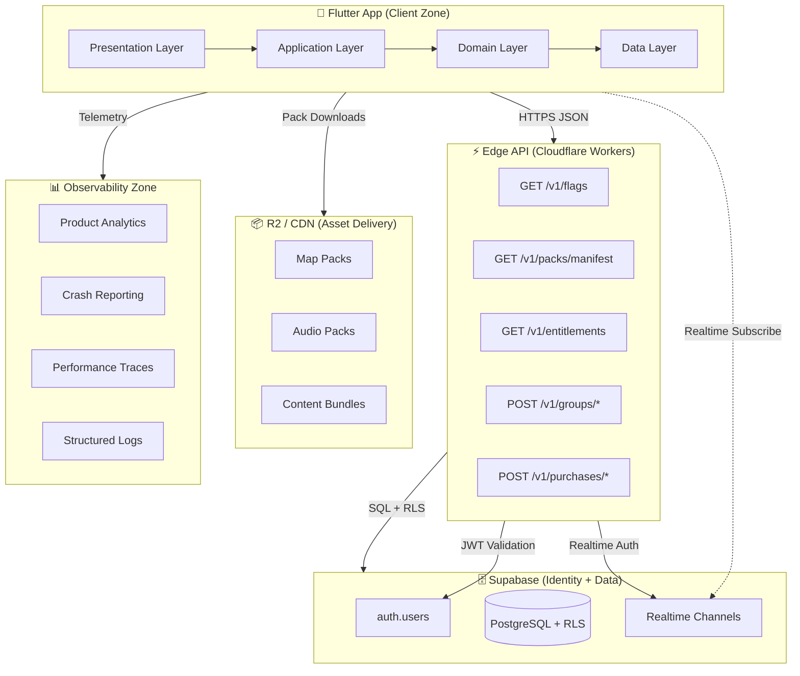

### Runtime Zone Responsibilities

| Zone | Technology | Responsibilities |
|---|---|---|
| **Flutter App** | Flutter/Dart | UI rendering, local-first data, offline logic, pack manager |
| **Edge API** | Cloudflare Workers | Auth validation, group coordination, entitlement validation, control-plane |
| **Identity/Data** | Supabase (PostgreSQL + Auth) | User identity, group records, entitlements, RLS enforcement |
| **Asset Delivery** | Cloudflare R2 + CDN | Pack artifact hosting, CDN-backed immutable asset delivery |
| **Observability** | Analytics + Crash + Perf | Product telemetry, crash reporting, performance tracing |

### Key Architectural Principles

- **Online surface is intentionally tiny** — only group coordination, entitlements, and purchase validation require the server
- **Cloudflare Workers sit at the edge** — JWT validation and group authorization happen before touching Supabase
- **RLS is mandatory** — every user-scoped and group-scoped table enforces Row Level Security in Postgres
- **Pack artifacts are immutable by version** — content changes publish new versions, never mutate in place
- **Realtime is selective** — only group live-board coordination uses Supabase Realtime channels

---

## 5. Flutter App Architecture

### Package Structure

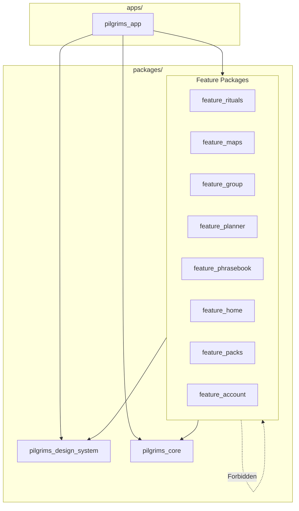

### Layer Architecture (per feature)

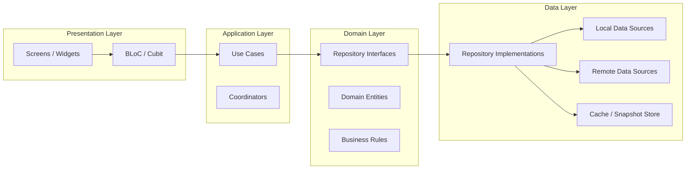

**Dependency Rule:** Dependencies flow inward only. `Presentation → Application → Domain ← Data`. Feature modules must never import from sibling feature packages.

### Module Boundary Rules

| Rule | Description |
|---|---|
| **No cross-feature imports** | Feature packages cannot import from other feature packages |
| **No hardcoded values** | Colors, spacing, strings — always from design system tokens or l10n |
| **Repository pattern required** | Data access goes through repository interfaces, never direct DB calls from widgets |
| **Platform channels isolated** | Native bridges (`StoreBridge`, `LocationBridge`, `BleBridge`) isolated in `pilgrims_core` |
| **State management** | BLoC/Cubit patterns only; no direct setState for complex state |
| **No feature-level theme redefinition** | Features consume theme tokens; they do not create parallel style systems |

---

## 6. Offline-First Architecture

### Offline Capability Tiers

```mermaid
graph TD
    TierA["🟢 Tier A — Fully Offline Capable\n(No network needed after first open)"]
    TierB["🟡 Tier B — Offline with Cached Snapshot\n(Useful but may be stale)"]
    TierC["🔴 Tier C — Online Required\n(Trusted server interaction required)"]
    TierD["⚪ Tier D — Rich Enhancement\n(Optional when online)"]

    TierA --- A1[Ritual guidance & RIC]
    TierA --- A2[Phrasebook & emergency tools]
    TierA --- A3[Save My Gate / saved anchors]
    TierA --- A4[Installed map & audio packs]
    TierA --- A5[Notes, bookmarks, planner, wallet]
    TierA --- A6[Medical profile & emergency info]

    TierB --- B1[Flags & season configuration]
    TierB --- B2[Pack manifest snapshot]
    TierB --- B3[Cached entitlement snapshot]

    TierC --- C1[Group join]
    TierC --- C2[Group check-ins & regroup pins]
    TierC --- C3[Purchase validation & restore]
    TierC --- C4[Authoritative entitlement refresh]

    TierD --- D1[Live board realtime updates]
    TierD --- D2[Server-backed pack recommendations]
    TierD --- D3[High-fidelity undownloaded map assets]
```

### Offline Data Flow

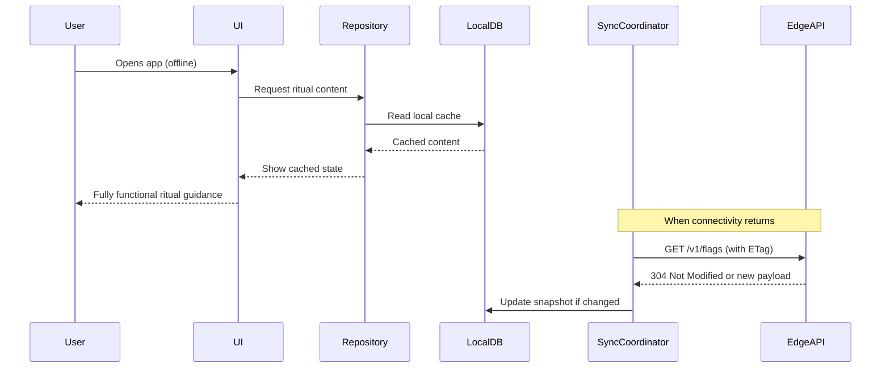

### Pack Lifecycle State Machine

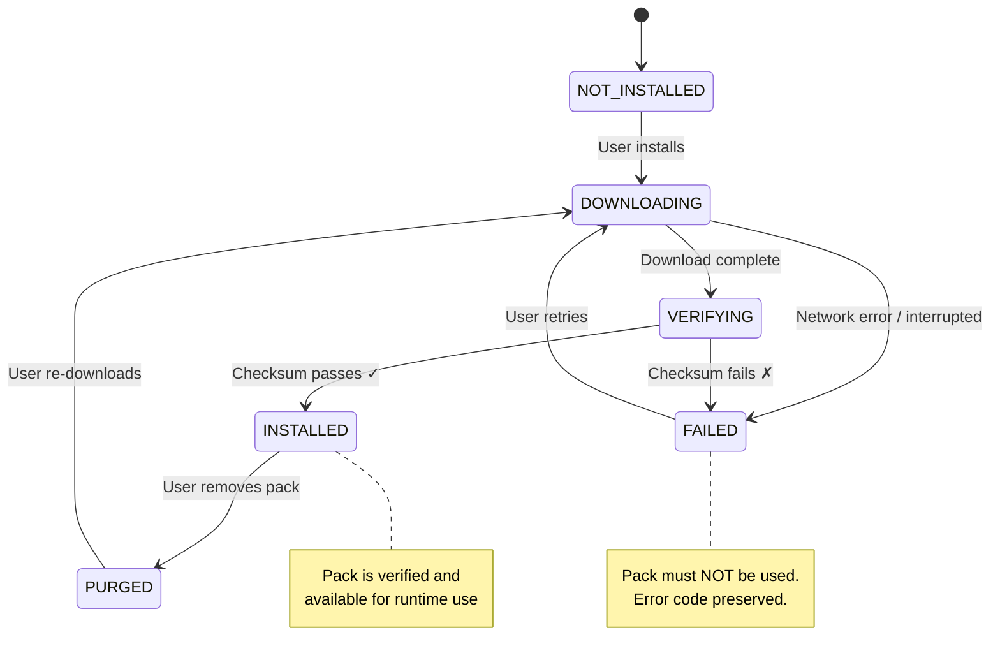

**Critical Rule:** `DOWNLOADING → INSTALLED` is a **forbidden transition**. Verification is mandatory before a pack is considered ready.

---

## 7. Feature Families Overview

### Feature Family Map

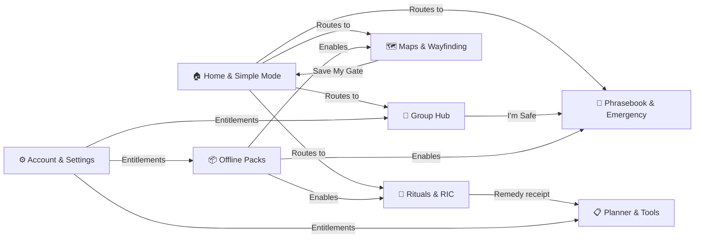

---

### 7.1 Onboarding, Home & Simple Mode (`SPEC 25`)

**Purpose:** First entry point into the product. Home is a *recovery surface*, not a feature dump.

**Startup Resolution Flow:**
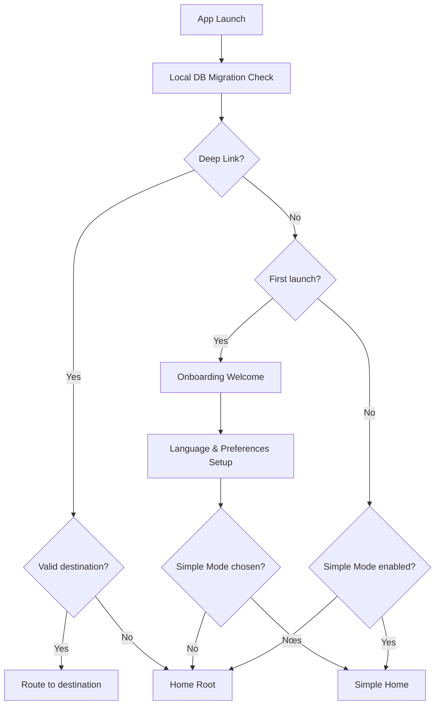

**Home Priority Order:**
1. Current ritual status card / Start Umrah
2. Urgent shortcut cluster (Phrasebook, Emergency, Save My Gate, I'm Safe)
3. Saved gate / recent map action
4. Active group summary
5. Planner / reminder summary
6. Pack readiness summary
7. Settings / Tools entry (lowest priority)

**Simple Mode Rules:**
- Same data, same features — only reduced visual complexity
- Priority: Ritual → Map/Gate → Group/Safe → Emergency/Phrase → Settings
- Must NOT be a separate disconnected app or fork of logic
- Persists across launches until user changes it

**Onboarding Rules:**
- No forced account creation before value is established
- No permission requests up front
- No monetization lead in first-use flow
- Max 3 screens: Welcome → Language/Preferences → Home

---

### 7.2 Rituals & RIC (`SPEC 18`)

**Purpose:** Guide pilgrims through Umrah and Hajj ritual steps correctly, and help them resolve mistakes with scholarly-verified guidance.

**Ritual Step Flow:**
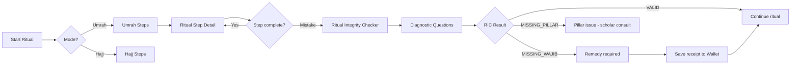

**Critical Rules:**
- Ritual content is **governed content** — must NOT be hardcoded; interfaces with versioned content bundles
- RIC output: `VALID`, `MISSING_WAJIB` (remedy), `MISSING_PILLAR` (serious), `REMEDY_REQUIRED`
- Supported paths: `Umrah`, `Tamattu`, `Qiran`, `Ifrad`
- Madhab support: `Hanafi`, `Shafii`, `Maliki`, `Hanbali` — content varies by selection
- Audio guides are an **enrichment** — ritual steps must remain fully usable as text-only
- Ritual screens are **banner-free** — safety alerts must not interrupt ritual steps

---

### 7.3 Maps, Save My Gate & 3D Wayfinding (`SPEC 19`)

**Purpose:** Help pilgrims orient themselves in the Haram and holy sites, recover their gate location, and navigate to destinations.

**Map Degradation Cascade:**
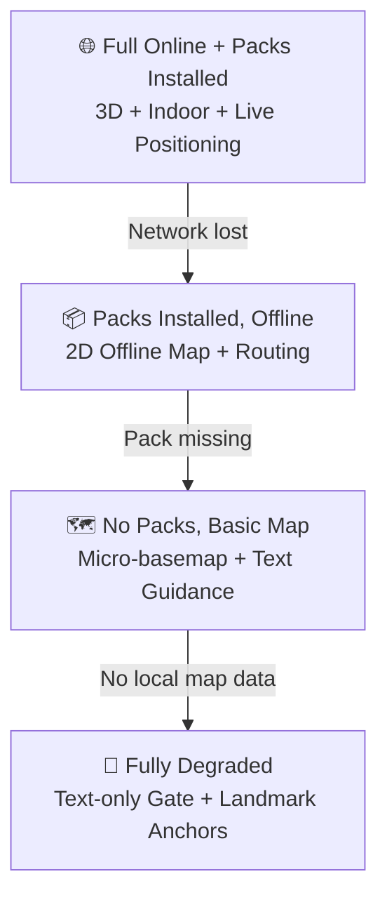

**Save My Gate — Core Recovery Primitive:**
- User saves gate number + level + zone + optional photo → stored locally
- Recall works **fully offline** — no network required
- Gate anchor can be shared as text (SMS-friendly) for group recovery
- Kinds: `GATE`, `LANDMARK`, `PIN`

**Map Architecture Rules:**
- Position confidence states: `HIGH`, `MEDIUM`, `LOW`, `UNAVAILABLE`
- Indoor/outdoor transitions handled by the positioning subsystem
- BLE beacon fusion where hardware permits — never assumed guaranteed
- Route requests degrade gracefully from 3D turn-by-turn → 2D route → text instructions

---

### 7.4 Group Hub, Check-ins & Coordination (`SPEC 20`)

**Purpose:** Allow pilgrims to coordinate as a group using privacy-light text-based tools — without continuous location surveillance.

**Group Coordination Flow:**
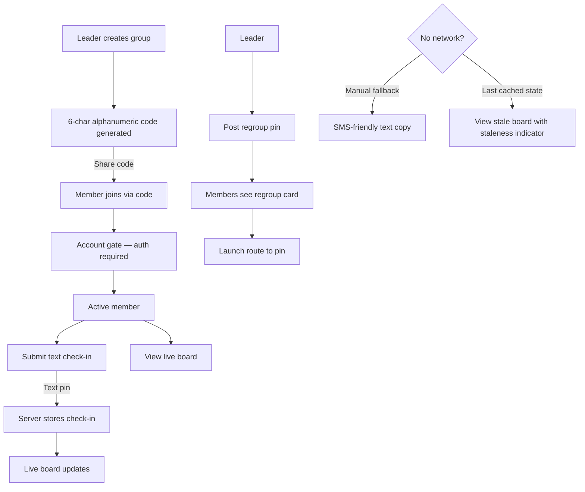

**Key Constraints:**
- Group join requires authentication — triggers `account_gate`
- Check-ins are **text-based** (`text_pin`) — no GPS coordinates required
- `GROUP_LIVE_BOARD` entitlement gate for Supporter-tier live board feature
- Regroup pin is **leader-only** write action
- Group code: exactly 6 uppercase alphanumeric characters, globally unique
- Member roles: `LEADER`, `MEMBER` — one active leader per group at all times
- Privacy: No continuous background location; "I'm Safe" is explicit user action

---

### 7.5 Planner, Reminders, Wallet, Notes & Bookmarks (`SPEC 21`)

**Purpose:** Lightweight personal tools for pilgrimage planning, receipt keeping, and content saving — all local-first.

| Tool | Purpose | Storage |
|---|---|---|
| **Planner** | Daily task list with templates | Device-local |
| **Reminders** | Local notifications for planner items | Device-local (OS scheduled) |
| **Wallet** | Remedy receipts and service proofs | Device-local |
| **Notes** | User-authored text with source context | Device-local |
| **Bookmarks** | Quick saved references to app content | Device-local |

**Key Rules:**
- All tools are **local-first** — no cloud sync, no server dependency
- Reminders use **OS-local notifications** — not remote push
- Wallet is a **records folder**, not a payment wallet or finance tracker
- `NOTES_BOOKMARKS_EXTENDED` entitlement unlocks: markdown, tags, multiple attachments, richer export
- Downgrade handling: existing rich notes remain readable; editing restricted to free-tier capabilities
- Templates are season-aware: Umrah templates by default, Hajj templates only when `season=hajj`

---

### 7.6 Phrasebook, Emergency & Assistive Tools (`SPEC 22`)

**Purpose:** Provide fast, calm access to communication tools, emergency information, and recovery shortcuts — especially under stress.

**Emergency Root Architecture:**
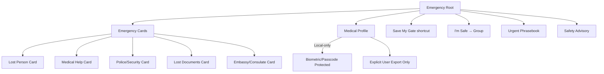

**Audio Priority for Phrasebook:**
1. Verified installed offline voice-pack clip
2. Online stream (if network available)
3. System TTS (only where explicitly allowed)
4. Text-only fallback — always available

**Critical Rules:**
- Basic phrase text, emergency cards, medical profile, and safety advisories are **always free** — never paywalled
- Medical profile is **local-only by default** — no sync, no upload, stronger local encryption
- App may pre-fill SMS templates but must **never auto-send or auto-dial**
- Safety alerts are **advisory** — they must never block ritual or recovery tasks
- Big-text phrase cards are a **first-class interaction model**, not a decorative mode

---

### 7.7 Offline Packs, Audio & Content Distribution (`SPEC 23`)

**Purpose:** Allow pilgrims to expand offline value by downloading asset bundles — keeping the base app lean.

**Pack Categories:**

| Category | Examples |
|---|---|
| `MAP` | Haram high-resolution tiles, holy sites tile sets, indoor structures |
| `AUDIO` | Phrasebook voice packs, guided ritual audio, phrase playback bundles |
| `CONTENT` | Structured offline content bundles (controlled use) |
| `MEDIA` | Future non-audio rich assets |

**Pack Recommendation Priority (Umrah season):**
1. Haram high-resolution map pack
2. Relevant app-language voice/audio pack
3. Other general-purpose packs

**Key Rules:**
- Base app must stay **lean** — heavy assets go in packs
- App must remain **meaningfully useful with no pack installed**
- `PACK_AUTO_DOWNLOAD` entitlement required for auto-download convenience
- `AUDIO_OFFLINE` entitlement required for offline audio playback
- Pack artifacts must never contain **executable code**
- Purging a pack must not remove unrelated user data

---

### 7.8 Account, Subscriptions, Entitlements & Settings (`SPEC 24`)

**Purpose:** Manage optional account access, Supporter subscriptions, trusted entitlement state, and app preferences.

**Entitlement Model:**

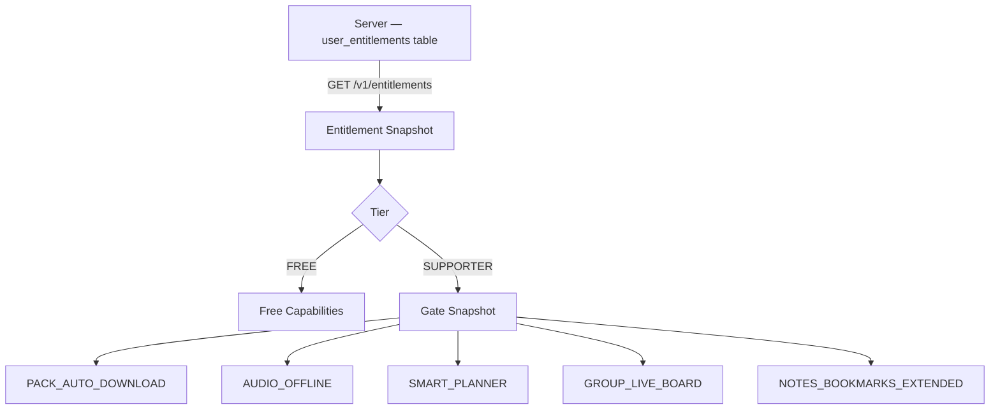

**Authentication Rules:**
- No forced sign-in on first launch
- Auth only triggered when a protected online feature requires it (group join, purchase restore)
- Sign-out preserves device-local data; clears server-backed session

**Settings Categories:**
- Account & profile
- Support this App (purchase/restore)
- App preferences (language, Simple Mode)
- Packs & downloads
- Notifications & permissions
- Privacy & data
- Help / About / App info

---

## 8. Screen & Navigation Map

### Top-Level Navigation Structure

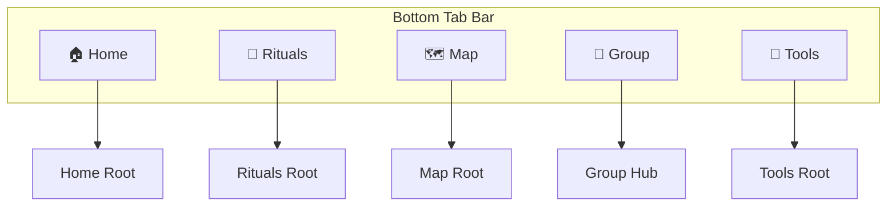

### Canonical Screen Inventory (41+ screens)

| Section | Screen ID | Purpose |
|---|---|---|
| **Entry** | `startup_resolver` | Launch state resolution and routing |
| **Entry** | `onboarding_welcome` | First-launch product value framing |
| **Entry** | `language_preferences_setup` | Language and minimal first-run setup |
| **Home** | `home_root` | Primary dashboard / recovery surface |
| **Home** | `simple_home` | Reduced-complexity entry for Simple Mode |
| **Home** | `simple_ritual_shortcut` | Simple Mode ritual entry |
| **Home** | `simple_map_shortcut` | Simple Mode map/gate entry |
| **Home** | `simple_group_shortcut` | Simple Mode group/safe entry |
| **Home** | `simple_emergency_shortcut` | Simple Mode emergency entry |
| **Rituals** | `rituals_root` | Ritual selection and active session entry |
| **Rituals** | `ritual_mode_path_selection` | Choose Umrah/Hajj + path + madhab |
| **Rituals** | `ritual_step_detail` | Current ritual step guidance |
| **Rituals** | `ric_entry` | Ritual integrity check entry |
| **Rituals** | `ric_questions` | RIC diagnostic questions |
| **Rituals** | `ric_result` | RIC outcome and remedy guidance |
| **Rituals** | `ritual_completion_summary` | Completed session summary |
| **Maps** | `map_root` | Main map with positioning and controls |
| **Maps** | `destination_search_picker` | Find and select a destination |
| **Maps** | `route_preview` | Route summary before guidance starts |
| **Maps** | `active_wayfinding` | Turn-by-turn / active route guidance |
| **Maps** | `save_my_gate_anchor` | Save current gate/anchor |
| **Maps** | `saved_anchor_detail` | View saved gate details and recall route |
| **Group** | `group_root` | Group hub / live board |
| **Group** | `join_group` | Join via group code |
| **Group** | `group_settings_detail` | Group info and management |
| **Group** | `checkin_sheet` | Submit a text-based check-in |
| **Group** | `regroup_pin_detail` | View and launch route to regroup pin |
| **Planner** | `planner_list` | Daily plan view |
| **Planner** | `planner_item_editor` | Create or edit a planner item |
| **Planner** | `wallet_list` | List of wallet artifacts |
| **Planner** | `wallet_item_detail` | View wallet artifact detail |
| **Planner** | `notes_list` | Notes and bookmarks library |
| **Planner** | `note_editor` | Create/edit a note |
| **Planner** | `bookmarks_list` | Saved bookmarks list |
| **Tools** | `phrasebook_root` | Phrasebook category browse and search |
| **Tools** | `phrase_card_detail` | Single phrase in big-text card |
| **Tools** | `emergency_root` | Urgent assistance hub |
| **Tools** | `emergency_card_detail` | Single emergency card (large text) |
| **Tools** | `medical_profile_view_edit` | Local medical profile |
| **Tools** | `safety_tips_sheet` | Safety advisories and tips |
| **Packs** | `pack_catalog` | Browse and manage offline packs |
| **Packs** | `pack_detail_install_flow` | Pack info, install, and purge |
| **Account** | `settings_root` | All settings and preferences |
| **Account** | `account_gate` | Auth request for protected features |
| **Account** | `support_this_app` | Supporter subscription and restore |

---

## 9. Data Model Overview

### Server-Side vs. Device-Local Persistence

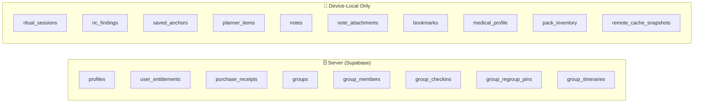

### Server Entity Relationships

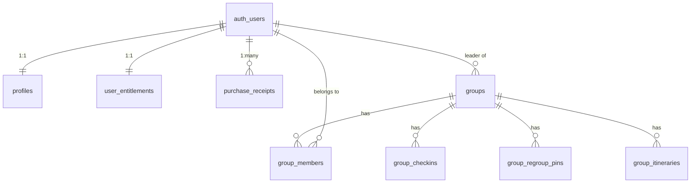

### Hard Data Invariants

| Invariant | Rule |
|---|---|
| **I-001** | Every `profiles` row belongs to exactly one `auth.users` identity |
| **I-010** | Users cannot read/write group data for groups they are not a member of |
| **I-012** | Only active leaders may create regroup pins |
| **I-013** | Group codes are exactly 6 uppercase alphanumeric characters, globally unique |
| **I-020** | Server-side entitlement state is authoritative; client may never invent or extend it |
| **I-030** | A pack must not be marked INSTALLED until checksum verification succeeds |
| **I-040** | `ric_status=VALID` is impossible when a required pillar is missing |
| **I-050** | Medical profile is local-only by default — never synced |

### Canonical Server Enums

```
entitlement_tier:    FREE | SUPPORTER
entitlement_source:  NONE | APPLE | GOOGLE | PROMO | FAMILY
group_member_role:   LEADER | MEMBER
group_member_status: ACTIVE | LEFT | REMOVED
group_season_scope:  UMRAH | HAJJ | MIXED
checkin_kind:        SAFE | CHECKIN | STATUS
```

### Canonical Local Enums

```
ritual_mode:   umrah | hajj
ritual_path:   Umrah | Tamattu | Qiran | Ifrad
madhhab:       Hanafi | Shafii | Maliki | Hanbali
ric_status:    VALID | MISSING_PILLAR | MISSING_WAJIB | REMEDY_REQUIRED
anchor_kind:   GATE | LANDMARK | PIN
pack_state:    NOT_INSTALLED | DOWNLOADING | VERIFYING | INSTALLED | FAILED | PURGED
```

---

## 10. API & Realtime Contracts

### Canonical Endpoint Catalog

| Method | Endpoint | Auth | Purpose |
|---|---|---|---|
| `GET` | `/v1/flags` | Public | Season, safety banners, feature toggles |
| `GET` | `/v1/packs/manifest` | Public | Downloadable pack catalog and metadata |
| `GET` | `/v1/entitlements` | Required | Current trusted entitlement snapshot |
| `GET` | `/v1/groups/{id}/live-board` | Required | Group coordination snapshot |
| `GET` | `/v1/groups/{id}/regroup-pins` | Required | Active regroup pins |
| `GET` | `/v1/groups/{id}/itinerary` | Required | Group shared itinerary |
| `POST` | `/v1/groups/join` | Required | Join a group by code |
| `POST` | `/v1/groups/{id}/checkins` | Required | Submit a text check-in |
| `POST` | `/v1/groups/{id}/regroup-pins` | Required | Create a regroup pin (leader only) |
| `PATCH` | `/v1/groups/{id}/regroup-pins/{pin}` | Required | Update/deactivate a regroup pin |
| `POST` | `/v1/purchases/validate` | Required | Validate a store purchase |
| `POST` | `/v1/purchases/restore` | Required | Restore purchases from store |

### Caching Policy

| Endpoint | Cache-Control | ETag | Offline Behavior |
|---|---|---|---|
| `GET /v1/flags` | `public, max-age=300` | ✓ | Last-good snapshot reused |
| `GET /v1/packs/manifest` | `public, max-age=1800` | ✓ | Last-good snapshot reused |
| `GET /v1/entitlements` | No public cache | — | Last-known snapshot for UX continuity only |

### Standard Error Envelope

```json
{
  "error": {
    "code": "VALIDATION_ERROR",
    "message": "Human-friendly summary",
    "fields": [{"path": "field_name", "issue": "explanation"}],
    "request_id": "req_..."
  }
}
```

**Canonical Error Codes:** `VALIDATION_ERROR` · `UNAUTHORIZED` · `FORBIDDEN` · `NOT_FOUND` · `CONFLICT` · `RATE_LIMITED` · `PRECONDITION_FAILED` · `INTEGRATION_ERROR` · `INTERNAL_ERROR`

### Idempotency Requirements

The following endpoints **require** an `Idempotency-Key: <uuid-v4>` header:
- `POST /v1/groups/join` (24h retention window)
- `POST /v1/purchases/validate`
- `POST /v1/purchases/restore`

### Realtime Channels (Group Coordination)

Realtime subscriptions via Supabase channels are used only for group live-board updates. All channels require authenticated JWT and active group membership validation. Realtime is an **enhancement** — the product must function without it.

---

## 11. Design System

### Visual Design Principles

| Principle | Meaning |
|---|---|
| **Content First** | User content and actions always outrank decorative surface treatment |
| **Calm Before Expressive** | Polished and elegant, but never at the expense of focus and clarity |
| **Semantic Styling** | Widgets styled via semantic tokens — never raw hex literals or magic numbers |
| **Stress-Safe Hierarchy** | Interface must be scannable when the user is tired, rushed, or anxious |
| **Legibility Over Translucency** | Glass effects serve hierarchy; they never harm text readability |

### Token Architecture

```
Foundation Tokens → Semantic Tokens → Component Tokens → Platform Tokens
     (scales)          (meaning)         (specifics)       (iOS/Android)
```

**Foundation tokens:** color palette, typography scale, spacing scale, radius scale, elevation, opacity, blur, motion durations, motion curves, icon sizes, border widths

**Semantic color roles:** `background` · `surface` · `surfaceElevated` · `surfaceFloating` · `surfaceGlass` · `textPrimary` · `textSecondary` · `actionPrimary` · `statusSuccess` · `statusWarning` · `statusCritical` · `focusRing` · `scrim`

### Glass / Liquid Glass Rules (iOS)

**Approved for glass treatment:**
- Navigation bars and top chrome
- Tab bars and bottom chrome
- Floating action trays
- Map overlay controls
- Filter/route chips (when contrast controlled)
- Modal headers and lightweight overlay containers

**Forbidden glass zones:**
- Long ritual text blocks or dense instructions
- Emergency cards and safety-critical warnings
- Dense forms or complex list rows
- Low-contrast map labels or route instructions

**Accessibility rule:** When `Reduce Transparency` or `Increase Contrast` is active, glass surfaces degrade to stronger solid/elevated surfaces with preserved hierarchy.

### Platform Adaptation

| Surface | iOS | Android |
|---|---|---|
| Navigation bars | Liquid Glass material | Solid elevated surface |
| Floating controls | Glass/blur treatment | Material You tonal elevation |
| Transitions | Page curl / slide system | Material shared-axis transitions |
| Simple Mode | Stronger solids even on iOS | Elevated card surfaces |

### Design System Package Structure

```
packages/pilgrims_design_system/
  lib/src/
    tokens/          # color, typography, spacing, radius, elevation, blur, motion
    themes/          # app_theme.dart, color_scheme, text_theme, extensions
    components/      # chrome/, actions/, inputs/, containers/, feedback/,
                     # maps/, rituals/, safety/, monetization/
    patterns/        # empty_states/, loading_states/, offline_states/
    platform/        # ios/, android/
```

---

## 12. Entitlements & Monetization

### Free vs. Supporter Matrix

| Feature | Free | Supporter |
|---|---|---|
| All ritual guidance & RIC | ✅ Always free | ✅ |
| Phrasebook text & emergency cards | ✅ Always free | ✅ |
| Medical profile & safety advisories | ✅ Always free | ✅ |
| Save My Gate & basic map | ✅ Always free | ✅ |
| Group join & manual coordination | ✅ Always free | ✅ |
| Basic planner, notes, bookmarks | ✅ Always free | ✅ |
| Offline audio playback (`AUDIO_OFFLINE`) | ❌ | ✅ |
| Pack auto-download (`PACK_AUTO_DOWNLOAD`) | ❌ | ✅ |
| Group Live Board (`GROUP_LIVE_BOARD`) | ❌ | ✅ |
| Smart Planner suggestions (`SMART_PLANNER`) | ❌ | ✅ |
| Extended Notes/Bookmarks (`NOTES_BOOKMARKS_EXTENDED`) | ❌ | ✅ |

**Non-negotiable rule:** Supporter must NEVER gate ritual correctness, RIC access, baseline map recovery, phrase text, emergency tools, or basic group coordination.

### Entitlement Flow

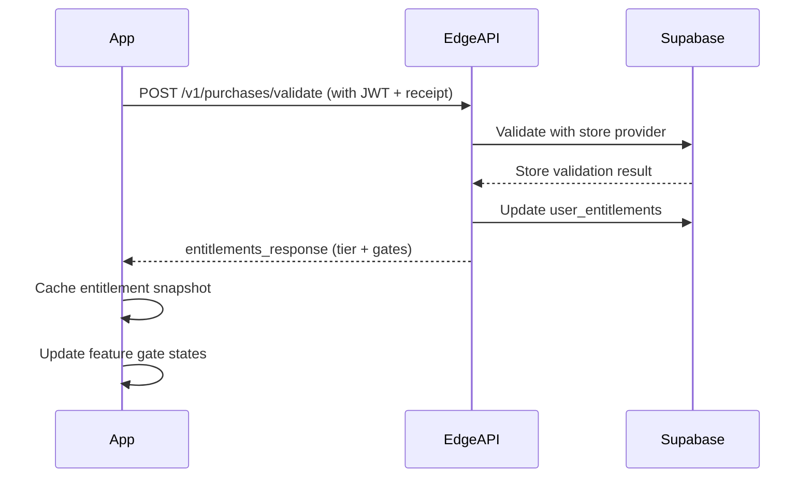

---

## 13. AI Agent Operational Rules

> These rules exist to prevent architecture degradation, religious content errors, privacy violations, and data model confusion. **All AI agents working on this project must follow them.**

### Before Starting Any Task

1. **Read relevant SPEC files** — never guess at requirements; read the normative spec first
2. **Check file `01_README_AND_MASTER_INDEX.md`** — verify which spec governs the area you're changing
3. **Understand the data ownership** — server vs. device-local is not negotiable (see `SPEC 13`)
4. **Understand the offline guarantees** — Tier A features must stay Tier A

### Code Discipline Rules

| Rule | Detail |
|---|---|
| **No hardcoded values** | No hex colors, magic numbers, or inline strings — always tokens or l10n keys |
| **No cross-feature imports** | Feature packages cannot import each other directly |
| **No invented entitlements** | Client code must never create, extend, or assume Supporter access |
| **No hardcoded ritual content** | Ritual steps, RIC rules, and remedy content come from versioned content bundles |
| **No medical data logging** | Medical profile content must never appear in analytics, logs, or crash reports |
| **No auto-send communications** | App may pre-fill SMS/share templates; it must never auto-send or auto-dial |
| **Verify before INSTALLED** | Pack state must never skip `VERIFYING` → `INSTALLED` without checksum passing |
| **No parallel style systems** | Feature modules cannot create unofficial color/spacing systems |

### Scope Rules

| Rule | Detail |
|---|---|
| **Umrah-first default** | Never surface Hajj-specific content as default without `season=hajj` being active |
| **No feature scope expansion** | Do not implement features not covered by an existing spec without explicit approval |
| **No server features for local data** | Notes, planner, medical profile, bookmarks remain local-only in V1 |
| **No background surveillance** | No continuous background location collection without explicit approved feature |

### When Stuck or Confused

1. **Stop and reread** the relevant SPEC file — do not guess
2. **Surface the ambiguity** — ask for clarification rather than making assumptions on correctness or religious content
3. **Do not destroy working code** to make a test pass — pause and request human review
4. **Do not silently change API contracts** — changes to `SPEC 14` require synchronized updates to clients, handlers, and tests

### Sync Documentation

- If you change an architectural truth during a task, update the relevant `SPEC` file in the same commit/PR
- Event name changes in analytics require a versioned change note and dashboard migration plan
- Enum changes require synchronized updates in schema, API, Flutter models, fixtures, tests, and analytics

---

## 14. Spec File Index

All normative specifications reside in the [`SPECS/`](./SPECS/) directory. The detailed master index is in [`SPECS/01_README_AND_MASTER_INDEX.md`](./SPECS/01_README_AND_MASTER_INDEX.md).

### Core & Governance

| File | Purpose |
|---|---|
| [`01_README_AND_MASTER_INDEX.md`](./SPECS/01_README_AND_MASTER_INDEX.md) | Root entry point and complete documentation system index |
| [`02_AI_AGENT_RULES_AND_WORKFLOW.md`](./SPECS/02_AI_AGENT_RULES_AND_WORKFLOW.md) | Operational rules for AI coding, reviewer, and debugging agents |
| [`03_PRODUCT_CHARTER_AND_SCOPE.md`](./SPECS/03_PRODUCT_CHARTER_AND_SCOPE.md) | Product identity, mission, ethical rules, boundaries, and release scope |
| [`04_DECISIONS_GLOSSARY_AND_CHANGE_CONTROL.md`](./SPECS/04_DECISIONS_GLOSSARY_AND_CHANGE_CONTROL.md) | Canonical glossary, decision history, and change control process |
| [`05_ROADMAP_PROGRESS_AND_CHANGELOG.md`](./SPECS/05_ROADMAP_PROGRESS_AND_CHANGELOG.md) | What is planned, built, changed, and in progress |

### Architecture & Engineering

| File | Purpose |
|---|---|
| [`06_SYSTEM_ARCHITECTURE.md`](./SPECS/06_SYSTEM_ARCHITECTURE.md) | Five runtime zones, component interaction, failure domains |
| [`07_FLUTTER_APP_ARCHITECTURE_AND_MODULE_BOUNDARIES.md`](./SPECS/07_FLUTTER_APP_ARCHITECTURE_AND_MODULE_BOUNDARIES.md) | Package structure, layer rules, dependency direction, forbidden patterns |
| [`08_DESIGN_SYSTEM_THEMES_TOKENS_AND_COMPONENTS.md`](./SPECS/08_DESIGN_SYSTEM_THEMES_TOKENS_AND_COMPONENTS.md) | Token architecture, color/typography system, component catalog, glass rules |
| [`09_PLATFORM_SPEC_IOS_LIQUID_GLASS_ANDROID_ADAPTATION_AND_NATIVE_BRIDGES.md`](./SPECS/09_PLATFORM_SPEC_IOS_LIQUID_GLASS_ANDROID_ADAPTATION_AND_NATIVE_BRIDGES.md) | iOS/Android styling, native bridge boundaries, platform-specific rules |

### Product & UX

| File | Purpose |
|---|---|
| [`10_PERSONAS_IA_USER_JOURNEYS_AND_TASK_FLOWS.md`](./SPECS/10_PERSONAS_IA_USER_JOURNEYS_AND_TASK_FLOWS.md) | Personas, information architecture, navigation hierarchy, task flows |
| [`11_SCREENS_STATES_NAVIGATION_AND_UI_BLUEPRINTS.md`](./SPECS/11_SCREENS_STATES_NAVIGATION_AND_UI_BLUEPRINTS.md) | All 41+ screen contracts, entry points, states, and navigation actions |
| [`12_COPY_LOCALIZATION_RTL_AND_ACCESSIBILITY.md`](./SPECS/12_COPY_LOCALIZATION_RTL_AND_ACCESSIBILITY.md) | Copy governance, RTL support, accessibility requirements |

### Data, APIs & Systems

| File | Purpose |
|---|---|
| [`13_DATA_MODEL_RLS_INVARIANTS_AND_MIGRATIONS.md`](./SPECS/13_DATA_MODEL_RLS_INVARIANTS_AND_MIGRATIONS.md) | Server schema, local persistence model, RLS policies, hard invariants |
| [`14_API_REALTIME_AND_INTEGRATION_CONTRACTS.md`](./SPECS/14_API_REALTIME_AND_INTEGRATION_CONTRACTS.md) | HTTP endpoints, request/response schemas, caching, error envelopes, realtime |
| [`15_OFFLINE_PACKS_SYNC_ASSET_DELIVERY_AND_CACHE_POLICY.md`](./SPECS/15_OFFLINE_PACKS_SYNC_ASSET_DELIVERY_AND_CACHE_POLICY.md) | Offline tiers, pack lifecycle, sync model, cache categories, failure handling |
| [`16_MAP_ARCHITECTURE_POSITIONING_ROUTING_3_D_AND_OFFLINE_WAYFINDING.md`](./SPECS/16_MAP_ARCHITECTURE_POSITIONING_ROUTING_3_D_AND_OFFLINE_WAYFINDING.md) | Map subsystem, positioning strategy, routing graph, 3D, offline wayfinding |
| [`17_ANALYTICS_OBSERVABILITY_AND_PERFORMANCE_BUDGETS.md`](./SPECS/17_ANALYTICS_OBSERVABILITY_AND_PERFORMANCE_BUDGETS.md) | Analytics taxonomy, privacy-safe telemetry, performance budgets, alert thresholds |

### Feature Families

| File | Feature Family |
|---|---|
| [`18_FEATURE_RITUALS_RIC_AND_RELIGIOUS_CONTENT.md`](./SPECS/18_FEATURE_RITUALS_RIC_AND_RELIGIOUS_CONTENT.md) | Ritual guidance, RIC mistake resolution, religious content governance |
| [`19_FEATURE_MAPS_SAVE_MY_GATE_AND_3_D_WAYFINDING.md`](./SPECS/19_FEATURE_MAPS_SAVE_MY_GATE_AND_3_D_WAYFINDING.md) | Maps, Save My Gate, destination routing, 3D/2D/text degradation |
| [`20_FEATURE_GROUP_HUB_CHECKINS_REGROUP_AND_SHARED_COORDINATION.md`](./SPECS/20_FEATURE_GROUP_HUB_CHECKINS_REGROUP_AND_SHARED_COORDINATION.md) | Group join, check-ins, regroup pins, live board, coordination |
| [`21_FEATURE_PLANNER_REMINDERS_WALLET_NOTES_AND_BOOKMARKS.md`](./SPECS/21_FEATURE_PLANNER_REMINDERS_WALLET_NOTES_AND_BOOKMARKS.md) | Local planner, reminders, wallet, notes, bookmarks |
| [`22_FEATURE_PHRASEBOOK_EMERGENCY_SAFETY_AND_ASSISTIVE_TOOLS.md`](./SPECS/22_FEATURE_PHRASEBOOK_EMERGENCY_SAFETY_AND_ASSISTIVE_TOOLS.md) | Phrasebook, emergency cards, medical profile, safety alerts |
| [`23_FEATURE_OFFLINE_PACKS_AUDIO_AND_CONTENT_DISTRIBUTION.md`](./SPECS/23_FEATURE_OFFLINE_PACKS_AUDIO_AND_CONTENT_DISTRIBUTION.md) | Pack catalog, pack install/purge, audio distribution |
| [`24_FEATURE_ACCOUNT_SUBSCRIPTIONS_ENTITLEMENTS_AND_SETTINGS.md`](./SPECS/24_FEATURE_ACCOUNT_SUBSCRIPTIONS_ENTITLEMENTS_AND_SETTINGS.md) | Account, Supporter subscriptions, entitlement gates, settings |
| [`25_FEATURE_ONBOARDING_HOME_AND_SIMPLE_MODE.md`](./SPECS/25_FEATURE_ONBOARDING_HOME_AND_SIMPLE_MODE.md) | Startup resolver, onboarding, Home Root, Simple Mode |

### Quality, Security & Delivery

| File | Purpose |
|---|---|
| [`26_CONTENT_MODEL_SCHOLAR_REVIEW_AND_PUBLISHING_WORKFLOW.md`](./SPECS/26_CONTENT_MODEL_SCHOLAR_REVIEW_AND_PUBLISHING_WORKFLOW.md) | Content types, Scholar Review lifecycle, publish/approval workflow |
| [`27_TESTING_STRATEGY_TEST_MATRIX_AND_DEVICE_LAB.md`](./SPECS/27_TESTING_STRATEGY_TEST_MATRIX_AND_DEVICE_LAB.md) | Test strategy, test matrix, device lab requirements |
| [`28_REAL_WORLD_VERIFICATION_RELEASE_GATES_AND_EVIDENCE.md`](./SPECS/28_REAL_WORLD_VERIFICATION_RELEASE_GATES_AND_EVIDENCE.md) | Release gates, real-world verification, evidence requirements |
| [`29_SECURITY_PRIVACY_COMPLIANCE_AND_RISK_REGISTER.md`](./SPECS/29_SECURITY_PRIVACY_COMPLIANCE_AND_RISK_REGISTER.md) | Data classification, encryption, retention, compliance, risk register |
| [`30_DELIVERY_RUNBOOK_INCIDENTS_ROLLBACK_AND_OPERATIONS.md`](./SPECS/30_DELIVERY_RUNBOOK_INCIDENTS_ROLLBACK_AND_OPERATIONS.md) | Deployment runbook, incident response, rollback procedures |

---

*This README is a high-level overview. The normative source of truth for every feature, API, data model, and rule is the corresponding `SPECS/` file. When in doubt, the SPEC wins.*
